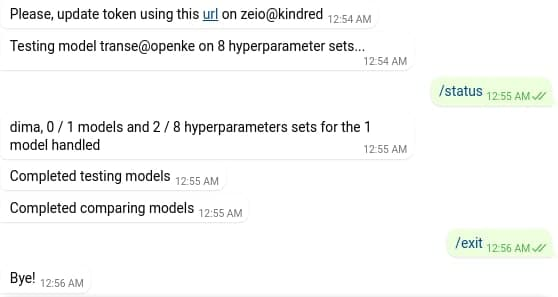

# relentness

Knowledge graph models manipulator which allows to perform various evaluations of provided embedders. Currently there is only an incomplete support for fetching **wikidata** triples and saving them in the format acceptable for the OpenKE toolkit (see examples of the generated datasets in the folder `Assets/Demo`).

# Setup

For being able to run python-based code you need to create a new environment and install the project dependencies:

```sh
conda env create --file environment.yml
```

# Usage

To generate a sample from wikidata using default params, execute the following command:

```sh
swift build && ./.build/debug/relentness Assets/Demo
```

The generated files will be saved in the directory `Assets/Demo`. To list all available option for the `sample` subcommand, please, use the following call:

```sh
./.build/debug/relentness sample --help
```

To test a model on a given dataset with transe model:

```sh
python -m relentness test ./Assets/Corpora/Demo/0000 -m transe
```

Aside from `transe` there is a `complex` model supported as well at the moment which requires a similar call.

# Integrations

## Google sheets

The applications allows to export results of models comparison into google spreadsheet with nice formatting which automatically highlights all the main points.

## Telegram API

It is possible to interact with the application via telegram bot. Upon startup you are able to provide any access token and fine-tune the app to send a wide range of notifications, the most interesting of which is the message that informs you about the need of updating OAuth2 access token to a third-party service. On the screen below an example of a short chat with telegram bot is provided.



